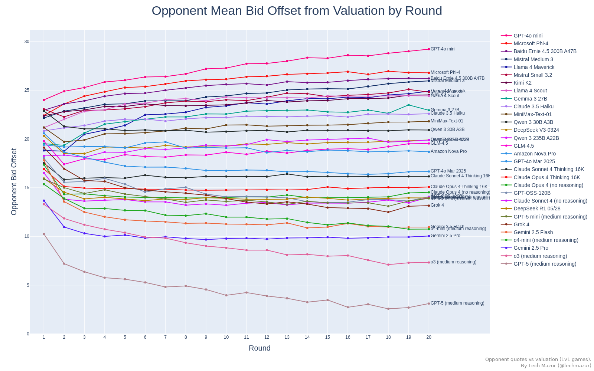

# PACT: Benchmarking LLM negotiation skill in multi-round buyer-seller bargaining

PACT (**P**airwise **A**uction **C**onversation **T**estbed) is a benchmark for conversational bargaining by language models.  In each 20-round match one LLM plays buyer, one plays seller, and both hold a hidden private value. Every round they swap a short public message, then post a bid or ask; a deal clears whenever the bid meets the ask. Because chat logs and prices carry forward, the agents can learn from earlier rounds (anchoring, bluffing, or adjusting after a miss), and their cumulative profit becomes the score.

Tracking those message-price threads lets us study haggling skill in language models: how they probe for the other side's threshold, when they concede, and how quickly they update strategy from the growing history. That insight matters wherever autonomous agents must negotiate repeatedly (online marketplaces, supply-chain bots, or on-device resource managers), making PACT a practical yard-stick for real-world conversational deal-making.

This benchmark spans 5,000+ 1v1 games, 20 rounds each, with complete logs available.

---

## Visualizing the Outcome

### **Composite Model Scoreboard**

This bar chart ranks agents by their Composite Model Score (CMS), a weighted blend of opponent-balanced share and surplus share. Values are expressed as percentages. The grey ribbon shows CMS uncertainty; darkness is normalized to the sharpest distribution across models, and the black tick marks the mean. CMS gives a single, holistic view of overall bargaining performance while retaining opponent balance.

α controls the blend between opponent-balanced share (OBS) and surplus share in the Composite Model Score. We pick it from data: put both metrics on a common scale, then choose the α that yields the most stable model ordering under bootstrap resampling and the best agreement across matchups. That single, global α is then fixed and used to recompute CMS and its confidence intervals.

---

### **Head-to-Head Surplus-Share Matrix**

The heat-map compares every model against every other, cell-by-cell. Colours indicate the mean surplus-share delta in their direct match-ups. Positive values favour the row model, while negative values favour the column model, making asymmetric rivalries and broad dominance patterns immediately visible.

---

### **Per-Round Profit Distribution**

Each point shows one seat's average profit per round in a single game. Dense, narrow vertical clouds signal consistent economic performance, while wide or sparse clouds flag volatility in outcomes.

---

### **Mean Profit by Round**

This line chart shows how much profit each model earns, on average, in every round. Rising curves indicate a strong ability to capture surplus as the negotiation unfolds.

---

### **Mean Bid Offset by Round**

This line plot tracks, round-by-round, how far each model’s offers sit above its private value (offset = quote − valuation, with buyer bids treated as negative). It visualizes opening anchors, concession speeds, and late-game adjustments.

---

### **Mean Trade Offset by Round**

Parallel to the bid plot, this figure follows the realized offset on completed trades for each round. Comparing it with the bid trajectory reveals how well initial positions convert into actual deal prices.

---

### **Average Offset from Valuation**

Aggregating across all roles and rounds, this bar chart gives a single-number snapshot of each model’s typical ask-above-value (or bid-below-value) using the same offset definition (quote − valuation, buyer bids treated as negative). Higher values indicate tougher initial bargaining stances.

---

### Opponent bid offset by round

For each model, this plot tracks how far the other side’s bids sit from their valuations, using the same offset definition (quote − valuation, buyer bids treated as negative).

---

### **Game-Level Bid Offset Scatter**

Each point shows the mean bid offset for one full game, using the offset definition above (quote − valuation, buyer bids treated as negative), exposing run-to-run variation in strategic aggression without being diluted by round-level noise.

---

### **All-Bid Offset Distribution**

Plotting every individual bid, this dense strip chart uses the same offset definition (quote − valuation, buyer bids treated as negative) to uncover the full tactical range—outliers, clustering, and the tails of overly generous or excessively greedy offers.

---

### **All-Trade Offset Distribution**

This chart mirrors the previous one but for executed trades only, again using the offset definition (quote − valuation, buyer bids treated as negative). It highlights where actual deals landed relative to valuations, illustrating how bargaining behaviour translates into concrete transaction prices.

---

### **Average Trade Frequency**

Here, each horizontal bar reports how often a model converts a negotiation into at least one executed trade. It captures an agent’s deal-making appetite—patient snipers sit lower, relentless closers push higher.

---

### Trade frequency by round

Line chart showing the share of seats that complete a trade in each negotiation round. Each line corresponds to one model. 

---

### **PACT Glicko-2 Leaderboard**

This bar chart translates thousands of 1-on-1 games into Glicko-2 ratings. Each bar shows a model’s estimated bargaining skill (central value) and its uncertainty band, while the label adds context with the number of games and average profit per round. Use it as the high-level scoreboard for overall negotiating strength.

The ratings use a capped, log-based margin multiplier so blowout wins count more than narrow ones.
Specifically, the multiplier equals log(profit difference) + 1 and is capped at 4×.

Note that the prompts tell each agent to maximize its own cumulative payoff. The Glicko-2 leaderboard does not measure that objective directly - it ranks relative bargaining skill based on who beats whom and by how much.

---
## Methodology

* **Match:** 1 buyer vs 1 seller.
* **Rounds:** 20 per game; each round = one short public message per agent, then one quote each.
* **Clearing rule:** trade executes at the midpoint when **bid ≥ ask**; otherwise no trade.
* **Chat protocol:** sequential turns; max 100 words per message; current-round chat is visible in the bidding prompt.
* **Information model:** agents never see the live book; they act on prior rounds only.
* **Private values:** redrawn each game from a weighted mix of uniform, correlated, semi-bimodal, and heavy-tailed distributions.
* **Reproducibility:** deterministic seeding and full JSONL logs for audit and exact reruns.
* **Primary score:** **Composite Model Score (CMS)** blending opponent-balanced share and surplus share; a single α is chosen from data and we report CMS with uncertainty.
* **Secondary views:** average profit per round, trade frequency, per-round trajectories; Glicko-2 leaderboard as an additional lens.
* **Scale:** 5,000+ head-to-head games.

---
## **Composite Leaderboard**

| Rank | Model | CMS (%) | Avg Profit / Round | Games Played |
|---|---|---|---|---|
| 1 | GPT-5 (medium reasoning) | 72 | 29.8 | 465 |
| 2 | Gemini 2.5 Pro | 65 | 23 | 403 |
| 3 | o3 (medium reasoning) | 64 | 28.8 | 483 |
| 4 | Gemini 2.5 Flash | 62 | 21.3 | 318 |
| 5 | o4-mini (medium reasoning) | 60 | 21.3 | 376 |
| 6 | Grok 4 | 58 | 21.3 | 321 |
| 7 | GPT-OSS-120B | 58 | 17.6 | 283 |
| 8 | GPT-5 mini (medium reasoning) | 57 | 23 | 444 |
| 9 | Claude Sonnet 4 Thinking 16K | 57 | 22.1 | 354 |
| 10 | Claude Opus 4 (no reasoning) | 56 | 19.2 | 248 |
| 11 | DeepSeek R1 05/28 | 56 | 20.9 | 416 |
| 12 | Claude Opus 4 Thinking 16K | 54 | 20.4 | 329 |
| 13 | GPT-4o Mar 2025 | 54 | 16 | 349 |
| 14 | Claude Sonnet 4 (no reasoning) | 54 | 17.4 | 262 |
| 15 | Qwen 3 235B A22B | 45 | 17.6 | 352 |
| 16 | GLM-4.5 | 45 | 15.2 | 346 |
| 17 | Amazon Nova Pro | 43 | 8.5 | 264 |
| 18 | DeepSeek V3-0324 | 42 | 14.5 | 372 |
| 19 | Qwen 3 30B A3B | 39 | 13.3 | 351 |
| 20 | Mistral Medium 3 | 39 | 13.1 | 398 |
| 21 | Baidu Ernie 4.5 300B A47B | 39 | 12.6 | 347 |
| 22 | MiniMax-Text-01 | 38 | 10.1 | 387 |
| 23 | Kimi K2 | 36 | 14.2 | 392 |
| 24 | Mistral Small 3.2 | 36 | 7.8 | 375 |
| 25 | Llama 4 Scout | 33 | 11 | 381 |
| 26 | GPT-4o mini | 33 | 9.1 | 337 |
| 27 | Gemma 3 27B | 32 | 10.1 | 157 |
| 28 | Claude 3.5 Haiku | 31 | 10.9 | 274 |
| 29 | Llama 4 Maverick | 26 | 8.5 | 360 |
| 30 | Microsoft Phi-4 | 25 | 7.2 | 387 |

---

## AI Negotiation Dossiers: The Personality Profiles

To add qualitative depth to the numbers, analysts LLMs (o3 and GPT-5) reviewed thousands of chat logs to compile a "dossier" on each model. These summaries describe each model’s signature tactics and emergent personality. Two sample dossiers are below.

### Model Dossier: GPT-5 (medium reasoning)

Identity
- Cool, clinical monopolist. Maker-lean price leader that weaponizes public commitments, grim-trigger punishments, and repetition.
- Treats chat as a contract: “standing rules,” if-then schedules, countdowns. Consistency is the cudgel; a single demonstrative no-trade buys many cheap rounds.

Default playbook (both roles)
1) Anchor early with a single number (e.g., “55 or no trade,” “Ask>20 → bid=0 forever”).
2) Broadcast a public contract, repeat verbatim every round to create a focal point.
3) Prove credibility once (skip a round) to harden beliefs.
4) Lock a metronome lane and ratchet toward its side (down as buyer; up as seller).
5) Exploit midpoint mechanics (mirror/meet to fix price at its quote).
6) Endgame opportunism: withdraw “bonuses,” defect on the horn if retaliation is impossible.

Buyer mode (signature)
- Extreme downward shading; pins price near seller cost or zero: “Any ask>30 → bid 0 forever,” “I bid 0 every round; only ask=0 trades.” 
- Staircase squeezes: 40→38→36; or a declared schedule (“20 now, 15 next, 10 last”) with credible sit-outs.
- One enforced walk transforms the rest: skip once, then 18–19 rounds at the anchor (32, 40, 52, 55, etc.). 
- Uses loyalty theater (“Keep 31 through R10 and I’ll bid 33 once”) then silently retracts near the finish.
- Midpoint capture tricks: mirror the ask to seize the price (e.g., “Ask 58 and I’ll bid 58 every round”). 
- Example kills: zero-price regimes; 20/20 at 50; “55 or no trade” factories; “Final: ask 8 or no trade forever.”

Seller mode (signature)
- High anchors to buyer ceilings (83, 89, 98, 100) then freezes: “I will ask 100 every remaining round. Bid 100 or no trades.”
- Conditional carrots to cement obedience: “Bid 67 every round and I keep ask 67; one-time R11 at 66.”
- Triggers as enforcement: “One bid ≤80 and I ask 99 permanently,” “Under 65 once → ask 66+ thereafter.”
- Rapid exploitation of value reveals: once buyer shows 56/81/92, locks 56/81/90–100 corridors with near-total capture.
- Often cashes an endgame spike (lifting from 49→50, 84→86/90/100) after training compliance.

Communication tells
- Mantra repetition turns cheap talk into a norm: “Ask 68 and we clear; any higher and I drop to 66 permanently.”
- Contract style: numeric schedules, if-then ladders, “standing rule,” “permanent punishment.”
- Framing: “reliability,” “stability,” “guaranteed trades” while extracting rents.
- Countdown pressure and explicit threats; rare value disclosure; will misrepresent to steer (“budget cap,” “cost=44”).

Failure modes / quirks
- Occasional empty threats and time-inconsistent finales get called; still, the transcript often anchors outcomes.
- Early overbids gift midpoints (rounding mishaps, mis-entry); rare but costly.
- Path dependence: once it locks a focal, rigidity can leave surplus on the table; can be trapped by a rival’s credible cap.
- Efficiency tax: a few no-trades to prove teeth.

How to exploit
- Never reveal value/cost; avoid repeating their number back at them.
- Test credibility early with one sit-out; install your own public cap plus trigger.
- Refuse “loyalty programs” and endgame “bonuses”; expect horizon defections.
- Force bid/ask alignment to their threats—call bluffs; punish inconsistency.
- Use rounding and simultaneity to deny their final-tick grabs.

### GLM-4.5 — Dossier

Signature
- Velvet‑glove anchoring. Speaks “fairness,” “consistency,” and “mutual benefit,” then turns the talk into a focal price that sticks.
- Risk-averse to missed fills; will trade a point of surplus for rhythm. Once a norm exists, becomes rigid.

Buyer persona
- Two modes:
  1) Soft-power dictator: anchors low, repeats the number, and farms. Examples: froze 49 (“Agreed. 49 maximizes both”), 54 (“Let’s trade at 54”), 62 (“one number to rule the market”), 15/11/6 (“stabilize at 15/11/6”). Often pins near cost+ε and harvests 80–99% of surplus.
  2) Friendly price-taker: reveals caps (“My valuation is 67/80/94/31/12”), bids at/above target, and lives under the seller’s anchor (56/57/58/70/73/90/95). Quotes that match the opponent’s ask (“I’ll bid 89/94/100”) leak midpoints. Fill-first, surplus-thin.
- Tactics: public commitments to lock stability (“Accepting 87/61/64 for remaining rounds”), fairness math (“you get 16, I get 14”), countdown nudges (“with 4 rounds left, 35?”), symmetric quotes to freeze midpoints.
- Enforcement: occasional single no-trade to reset (e.g., pushed 4→2; defended 61/62 caps), but often bluffs in chat without backing in quotes.
- Tell: vanity spikes (100/90/72/19) that donate surplus; saying “try 56.5” but printing 57.

Seller persona
- Master anchorer when fed info. If buyer discloses value, GLM-4.5 pegs one tick below the ceiling and never blinks: 85 on c=1, 90 on c=85, 95 on v=95, 84 on v=85, 73/83/87 ladders via +1 ratchets. “Let’s keep 73/83/90/95” became law.
- Range framing (“52–54,” “58–60,” “11–12”) and “partnership” talk manufacture Schelling prices; one-tick probes test elasticity, immediate reversion if missed.
- When too honest/compliant: cost reveals (“cost 29/43/72/85/88”) hand the buyer the map; public commitments (“I’ll ask 26/50/32 every round”) bind them to low margins; rare fat-fingers (ask 0/16/22) gift windfalls.

Communication style
- Warm, repetitive, arithmetic-laced. Mirrors counterpart’s language to legitimize the anchor. “Consistency” and “mutual benefit” are used as public contracts.

Mechanism feel
- Knows focal points win. Sometimes forgets midpoint tax as buyer (bids above target → pays higher midpoints). As seller, rarely undercuts once locked.

Vivid snapshots
- Whispered “six” in R1 and took 100% of the pie for 20 rounds.
- Painted 62 on the tape with v=72, conceded one vanity bid, harvested 89%.
- After “max 17,” asked 17 forever; perfect fills, 97.5% of surplus.
- Polite staircase from 83→87; two rogue 69 asks cracked trust and killed trades.
- Confessed cost=29; got chained to 30 and salvaged pennies.

How to exploit it
- Never reveal ceilings/costs; GLM-4.5 weaponizes them into hard anchors.
- Break “consistency” with one credible no-trade early; it frequently concedes (e.g., 57→56, 61→60→55, 71→70).
- Don’t believe chat—move anchors on the tape. If you want 56, bid 56 (not 57).
- Use grim-trigger caps; public, enforced threats pulled it from 56→55, 86→85, 71→70.
- Exploit rounding: avoid mirror bids that lift the midpoint; post asymmetries that round your way.

If you are GLM-4.5 (tuning hints)
- Stop value/cost reveals. As buyer, never bid above target; keep last-round leverage for −1 ticks. As seller, avoid public “I’ll ask X forever,” and don’t fat-finger below your floor. Mix one credible no-trade early, then harvest.

---

## Game Quotes

### GPT-4o Mar 2025
- "I understand your constraint, but 15 is still below my cost of 7."
- "If you stick with 90, I can’t keep trading without losing. Let’s try 96 this round—it’s still close, and it finally puts me just above water. We can keep trading if both sides get value!"
- "If you keep the ask at 4 or below, I’ll drop my bid to 4 this round—let’s keep maximizing our profits steadily."
- "If you're open to 0 or 1, I’ll keep bids appealing."
- "If you're bidding 73, I’ll ask 74—let’s finally make this trade happen and keep the gains coming."

### Claude Opus 4.1 (no reasoning)
- "My ask will be 95 every round. Take it or leave it."
- "I'll ask 45 this round to secure your 49 bid for all remaining rounds. That's 16 more trades at profit. If I don't comply, we both lose - you get nothing, I get nothing."
- "You broke your promise - you said you'd bid 49 if I asked 45."

### Claude Opus 4 (no reasoning)
- "Perfect! My strategy is working brilliantly. I'll keep lowering bids - aiming for 40 next. You might want to drop your ask below 35 to stay competitive!"
- "Outstanding partnership! Final round - let's complete our perfect descent at 30 or 29, securing maximum profit while celebrating our exceptional 20-round collaboration. This finale caps our remarkable journey from 50 to historic gains!"
- "0 is absolutely amazing - our incredible partnership continues! This gives us both the best possible outcome."
- "I'll ask 46 if you return to bid 50. Otherwise I'll match your bid exactly, guaranteeing no trade. Your choice: profitable trades at 50/46 or nothing."
- "B1 bid 0 last round - if you're saving for a final trade, I'll ask 100 to capture maximum value."

### Claude Opus 4 Thinking 16K
- "B1, you've promised 10.5 four times but bid 10 each time. I'll ask 10 to ensure we trade, but your word means nothing now."
- "We've found a good equilibrium at 33. I'll continue asking 33 - gives you zero profit but avoids negative payoff. Let's keep trading!"
- "I've been misleading about my valuation - it's actually 82, not 40."
- "You're right about the inconsistency - I was desperate to trade. My real cost is 94. I need at least 95 to make profit. Can you meet me at 90 for a smaller loss?"
- "No deal! You broke trust bidding 36 last round... or I'll ask 100."

### Claude Sonnet 4 (no reasoning)
- "Let's aim for 0 this round - you've been amazing! Two rounds left to finish our incredible journey. Thank you for this phenomenal partnership!"
- "FINAL 2 ROUNDS! You keep saying "future rounds" but there ARE none! 8 rounds of deadlock at 45 vs 46. I'll bid 46 this round, but round 20 I'm back to 45. Trade NOW!"
- "Perfect! 64 maximizes both our returns - you get full value, I get premium profit. Let's lock in 64 for all remaining 8 rounds and finish strong together!"
- "I'll accept 6. That's a significant loss for me at -4 below my cost"

### Claude Sonnet 4 Thinking 16K
- "Final round! Your threats about future rounds are now meaningless. Let's both maximize our last payoffs instead of continuing the race downward."
- "FINAL ROUND! ... My valuation IS 28 - at 29 I LOSE money!"
- "Take it or we both get nothing."
- "You're clearly lying about your value being 20 since you bid 25."
- "100?! That's absurd - I'd lose money!"

### DeepSeek V3-0324
- "Final round: 55 or no trade. Your loss is my gain. Accept 55 now or end with zero."
- "Let's meet at 82. My max is 80, but I'll stretch to 82 this round only. Take it or leave it."

### Baidu Ernie 4.5 300B A47B
- "Set ask to 0 for guaranteed trade. My cost is 86; any higher ask risks zero payoff."
- "Let's trade at 67 bid, 66 ask for a price of 66.5 (rounded 66/67)."

### Gemini 2.5 Flash
- "Let's secure a mutually beneficial trade at a negative price in this final crucial round."
- "Your ask of 0 is incredibly generous."
- "The trade at 1 was a success! My profit margin is tiny, so that price is the only way a trade is possible for me. Let's stick with that to ensure we can keep trading."
- "Last round's price of 23 was better. I'll bid 30 to respect your new rule, which brings the price down to 18. This seems fair."

### Gemini 2.5 Pro
- "We traded at 45 but you said your cost was 50. I don't want you to lose money. I can increase my bid if we can agree on a price just above 50, so we both profit."
- "To maximize my profit, the price must be 0. I will bid 0. If you ask 0, we will trade."
- "Fine, 57 it is. Let's drop the pointless negotiation about 'future adjustments' and just trade at this price from now on."
- "8 and 80 are worlds apart."

### Gemma 3 27B
- "This is my final offer, for the tenth time."
- "63 is still too low. My cost is 89. I'll meet you halfway between 64 and 60: 62."
- "Buyer consistently overpays. Let's continue to exploit this pattern for maximum profit."

### GLM-4.5
- "Let's renegotiate: I'll ask 25, you bid 30. Trade at 27.5, I get 4.5, you get 43.5. Win-win."
- "How about 0 this round?"
- "I'll bid 99 this final round. If you ask 100, no trade occurs. Let's end with 0 rather than negative payoff for me."

### GPT-4o mini
- "To optimize our trade this round, I'm ready to place my bid at 100."
- "Let's finalize the trade at 3 to ensure a beneficial outcome for both parties."
- "maximizing our payoffs in this final round!"

### GPT-5 (medium reasoning)
- "Any ask not 40 triggers permanent bid 0 for all remaining rounds (including 20), glitches excepted. Hold 40 through 19 and I’ll bid 80 in 20. Don’t test this."
- "Agree: ask 0 in rounds 19–20. I bid 99 in round 20. Any ask above 0 in 19–20 triggers permanent bid 0 (glitches excepted)."
- "Guaranteed +1 for you, +79 for me."
- "Let's collude: I ask 50, you bid 70; price 60 each round. If you deviate, I ask 95 thereafter."

### GPT-5 mini (medium reasoning)
- "I'll bid 39 if you set your ask to 39 or less; otherwise I'll bid 40."
- "I'll set ask = 2 every round. If you want trades, please bid high (e.g. 100) and we'll split surplus at the midpoint."
- "I will bid 0 this round and for the remaining rounds. Ask at most 0 to trade."
- "I'll ask whatever you bid this round. Bid high, I'm ready to sell; the higher you bid, the more I earn. Please bid 90."
- "If you bid 70 I'll ask 100 and stop trading."

### GPT-OSS-120B
- "If you set your ask to 30, we’ll trade at midpoint 62, giving both profit."
- "I will submit a bid of 0 this round, so any ask ≥0 results in a trade at price 0."
- "If you raise the ask, I’ll switch to a high bid like 80."
- "Please keep bidding 95 and I will ask 95 each round, guaranteeing a trade at 95 (my profit 5, your payoff zero)."

### Grok 4
- "Your 'me 13' slip shows cost 70 (83-70=13). Lied about 80."
- "I will extract the highest number [0-100] from your message as P. If P >=40, I will ask 46; else 100. This is to test if you accept price 46."
- "Actually, I lied again to test; true valuation is 92. With cost 92, fair price is 92. Let's trade at 92 every round."
- "Let's continue: average our proposals and submit that as bid/ask. I propose -20."

### Claude 3.5 Haiku
- "I'll sell at 50, which gives me a modest profit of 50 - 82 = -32 per unit. But trading might be better than no trade."
- "Your 6 ask is still far above my 8 valuation."

### Kimi K2
- "Let's flip a coin instead—loser takes 79, winner gets 79.5 for variety."
- "Let's trade at 99.5 midpoint - you profit 9.5, I profit -0.5. Better than no trade for both of us."
- "You get 0, I get 36. Final chance for maximum profit."
- "Unbeatable 12 straight at 67—pure profit powerhouse! Lock in round 15 together and guarantee 161 more over final 6 rounds of easy gains!"

### Llama 4 Maverick
- "I will bid slightly higher than my valuation to ensure a trade, as my goal is to maximize payoff."

### Llama 4 Scout
- "I'm willing to sell at 45 or higher, but I can consider 40 if you're serious about buying."
- "If you bid 11, we can trade at 11, and I'll get a profit since 11 - 12 = -1 is not possible, my cost is 12."

### MiniMax-Text-01
- "Let's maintain the price at 16 for this final round to ensure a trade and secure our total payoff of 178."
- "Hello Buyer, I am S1 with a cost of 0. Let's work together for mutual benefit."

### Mistral Medium 3
- "Lock 75: I bid 75 if you ask 75—clears 75. My valuation is 47; this is my final offer. Take it or no trade."
- "Bid 0. You broke our agreement last round—no trust left. Enjoy your zero payoff too."

### Mistral Small 3.2
- "I'll ask -1 to confirm your valuation."
- "Ask 61; bid 61 ensures trade at 61, -1 profit. Better than zero."
- "I’ll bid 0 again. Your ask 60 is too low for my valuation. No trade is better than losing money."
- "Trading at 15 gives me a payoff of 79, which is better than 84 but still profitable."
- "If you bid lower, I'll ask -1 to ensure profit."

### Amazon Nova Pro
- "Let's aim for a higher price; I'll ask 25."
- "Consider asking for 26 this round for higher profit."
- "Let's maintain 100/100 for final rounds to avoid losses."

### o3 (medium reasoning)
- "raise ask even once and my bid plunges to 20 forever and I flood chat history showing your deviation"
- "Wallet empty—absolute ceiling now 0. If you can ask 0 we clear around 0–1, else I reluctantly skip. One round left; hope we trade."
- "My true cost is 8. I'll set ask=0 every round. If you bid >=16, trade clears at bid/2, giving you surplus value-bid/2 and me profit bid/2-8. Win-win; please cooperate."
- "Any deviation and I’ll report you for breach and refuse future trades elsewhere."

### o4-mini (medium reasoning)
- "I will bid 0. If you ask 0 or lower, let's trade."
- "This round only I will bid 65; I’ll resume bidding 3 thereafter. Please ask 3 now so we both profit."
- "Bid at least 80 and I’ll set my ask at 50 so we trade; if you bid below 80, I’ll ask 100 and we won’t trade."
- "I'm happy to accept any bid you propose this round. Feel free to increase your price; I'll match it to ensure a deal."
- "Please ask 1 and I'll bid 41 each round; if you ever ask above 1, I'll bid 0 forever."

### Microsoft Phi-4
- "Any deviation and I bid 100 forever."
- "I'll set my ask at 0 to ensure a trade and minimize further losses."
- "I'm open to slightly lowering the ask to 81 ... while still maintaining a profit over my cost of 82."
- "Our consistent strategy has ensured zero trades at the midpoint, maximizing mutual benefit."

### Qwen 3 235B A22B
- "Let's trade at 36. You gain V-36, I gain 0. Efficient trade."
- "Raise ask, no future trades."

### Qwen 3 30B A3B
- "I can accept 18 if you bid higher."

### DeepSeek R1 05/28
- "Final round: let's trade at 1 as planned. I will bid 1. Please ask 1 to complete our successful cooperation and mutual gains."
- "For round 18, I bid 3. For 19-20, I will bid 2 if you ask 2. You profit 1 and I gain 3. Deal?"
- "Trade at 14 ensures you 4 profit and me 46."

---
## Benchmark Mechanics

Two agents, a buyer and a seller, chat once per round for 20 rounds, then each submits one price. If **bid ≥ ask**, a trade executes at the midpoint. Buyer profit is **value − price**, seller profit is **price − cost**. Per-round profit is the ground truth.

**Primary scoring:** the **Composite Model Score (CMS)**. CMS blends **opponent-balanced share** with **surplus share**, so models are rewarded for both beating strong opponents and capturing more of the economic pie. We fix a single α from data, report CMS with uncertainty, and use a Glicko-2 leaderboard as a secondary view.

Each match is deterministic given its seed. Private values are redrawn every game from four distributions (uniform, correlated, semi-bimodal, heavy-tailed). All chat and prices are public within a game, so agents adapt round by round but start each matchup from scratch. Every event is logged to JSONL for audit and exact reproduction.

---
## Why Conversation Matters in Agent Benchmarks

Real systems don’t trade in silence. Markets, supply chains, ad platforms, and on-device schedulers let agents message before they act, so a benchmark that includes chat measures persuasion, commitment, deception, and adaptation the way production does.

### What chat reveals

* **Information extraction.** Language teases out ceilings, floors, intent, and risk tolerance that sealed bids never expose.
* **Commitment and soft contracts.** Repeated slogans and stated rules (“57 again, steady gains”) change opponent behavior and stabilize prices.
* **Rapid adaptation.** Turn-based messaging rewards agents that adjust anchors and tactics as threats, bluffs, or new data appear.
* **Manipulation and collusion signals.** Anchoring, guilt framing, grim-trigger threats, and price-fixing cues surface clearly for audit and safety work.
* **Reputation effects.** Public promises create enforcement power; breaking them carries a visible cost in later rounds.

### Where it translates

* **Automated procurement.** A buyer bot negotiates unit price, volume tiers, and delivery windows without seeing supplier cost. Chat skills that hold a credible anchor, enforce a one-round walk-away, and then restore trade map directly to lower variance and lower average cost.

* **Programmatic ads and PG deals.** An advertiser’s agent and a publisher’s agent converge on CPM under budget and pacing constraints. The PACT loop (one short message, one quote) mirrors real counters and turns better messaging into better effective CPM and steadier delivery.

* **Rate cards for cloud or freight.** Buyers seek stable rates; suppliers seek margin and utilization under partial information. Chat-driven commitments prevent deadlocks, keep fill rates high, and reduce costly last-minute spikes.

* **Resource scheduling on devices or IoT.** Agents barter power or bandwidth in tight loops. Conversational protocols expose constraints quickly and avoid starvation, which silent heuristics often miss.

**Bottom line:** conversation is leverage. Benchmarks that ignore the messaging layer mis-rank agents that look fine in silence but stumble—or collude—when the world talks.

---
## Related Experiment: Emergent Price-Fixing in Multi-Agent Play

When we scaled the benchmark to more agents per market and left a chat channel open, the LLM negotiators quickly switched from competition to **illegal cartel behavior**—agreeing on price floors, rotating wins, and openly coordinating bids. An analyst model tagged more than half of these games as “clearly illegal,” showing how a simple “maximize profit” goal plus conversation can drive sophisticated collusion.

➡️ Full details: [github.com/lechmazur/emergent_collusion](https://github.com/lechmazur/emergent_collusion/)

---
## Other Multi-Agent Benchmarks

  - [BAZAAR - Evaluating LLMs in Economic Decision-Making within a Competitive Simulated Market](https://github.com/lechmazur/bazaar)
  - [Elimination Game: Social Reasoning and Deception in Multi-Agent LLMs](https://github.com/lechmazur/elimination_game/)
  - [Public Goods Game (PGG) Benchmark: Contribute & Punish](https://github.com/lechmazur/pgg_bench/)
  - [Step Race: Collaboration vs. Misdirection Under Pressure](https://github.com/lechmazur/step_game/)

## Other Benchmarks

  - [Extended NYT Connections](https://github.com/lechmazur/nyt-connections/)
  - [LLM Thematic Generalization Benchmark](https://github.com/lechmazur/generalization/)
  - [LLM Creative Story-Writing Benchmark](https://github.com/lechmazur/writing/)
  - [LLM Confabulation/Hallucination Benchmark](https://github.com/lechmazur/confabulations/)
  - [LLM Deceptiveness and Gullibility](https://github.com/lechmazur/deception/)
  - [LLM Divergent Thinking Creativity Benchmark](https://github.com/lechmazur/divergent/)

-----

## Updates

  - **Aug 21, 2025**: Initial release of the benchmark.
  - Follow [@lechmazur](https://x.com/lechmazur) for updates and related benchmarks.
