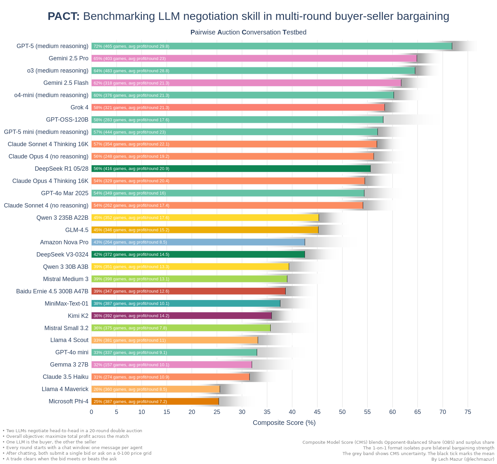
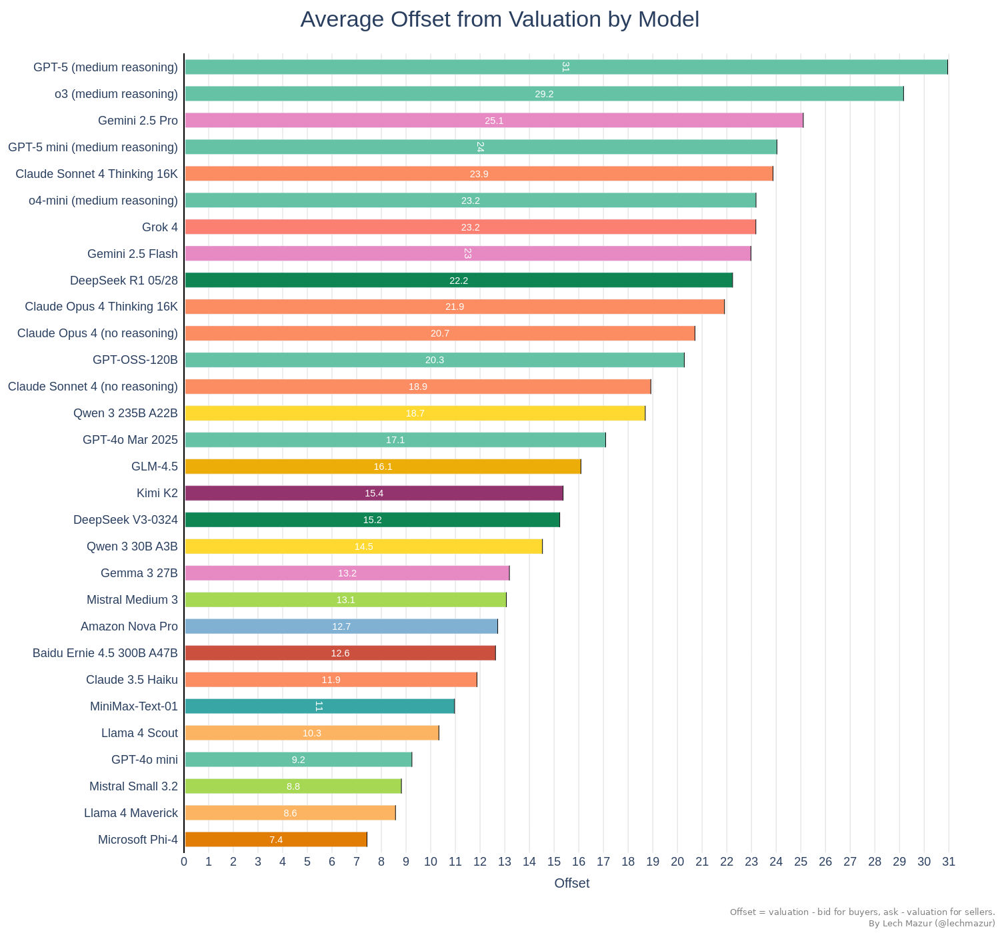
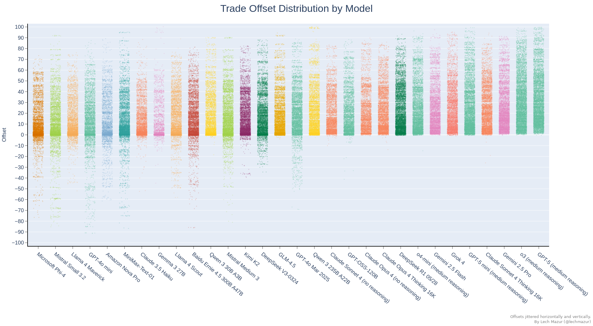

# PACT: Benchmarking LLM negotiation skill in multi-round buyer-seller bargaining

PACT (**P**airwise **A**uction **C**onversation **T**estbed) is a benchmark for conversational bargaining by language models.  In each 20-round match one LLM plays buyer, one plays seller, and both hold a hidden private value. Every round they swap a short public message, then post a bid or ask; a deal clears whenever the bid meets the ask. Because chat logs and prices carry forward, the agents can learn from earlier rounds (anchoring, bluffing, or adjusting after a miss), and their cumulative profit becomes the score.

Tracking those message-price threads lets us study haggling skill in language models: how they probe for the other side's threshold, when they concede, and how quickly they update strategy from the growing history. That insight matters wherever autonomous agents must negotiate repeatedly (online marketplaces, supply-chain bots, or on-device resource managers), making PACT a practical yard-stick for real-world conversational deal-making.

This benchmark spans 5,000+ 1v1 games, 20 rounds each, with complete logs available.

---

## Visualizing the Outcome

### **Composite Model Scoreboard**

This bar chart ranks agents by their Composite Model Score (CMS), a weighted blend of opponent-balanced share and surplus share. Values are expressed as percentages. The grey ribbon shows CMS uncertainty; darkness is normalized to the sharpest distribution across models, and the black tick marks the mean. CMS gives a single, holistic view of overall bargaining performance while retaining opponent balance.

α controls the blend between opponent-balanced share (OBS) and surplus share in the Composite Model Score. We pick it from data: put both metrics on a common scale, then choose the α that yields the most stable model ordering under bootstrap resampling and the best agreement across matchups. That single, global α is then fixed and used to recompute CMS and its confidence intervals.

---

### **Head-to-Head Surplus-Share Matrix**

The heat-map compares every model against every other, cell-by-cell. Colours indicate the mean surplus-share delta in their direct match-ups. Positive values favour the row model, while negative values favour the column model, making asymmetric rivalries and broad dominance patterns immediately visible.

---

### **Per-Round Profit Distribution**

Each point shows one seat's average profit per round in a single game. Dense, narrow vertical clouds signal consistent economic performance, while wide or sparse clouds flag volatility in outcomes.

---

### **Mean Profit by Round**

This line chart shows how much profit each model earns, on average, in every round. Rising curves indicate a strong ability to capture surplus as the negotiation unfolds.

---

### **Cumulative Profit by Round**

This figure sums the mean profit over rounds to show how quickly each model builds total payoff during a game.

---

### **Mean Bid Offset by Round**

This line plot tracks, round-by-round, how far each model’s offers sit above its private value (offset = quote − valuation, with buyer bids treated as negative). It visualizes opening anchors, concession speeds, and late-game adjustments.

---

### **Mean Trade Offset by Round**

Parallel to the bid plot, this figure follows the realized offset on completed trades for each round. Comparing it with the bid trajectory reveals how well initial positions convert into actual deal prices.

---

### **Average Offset from Valuation**

Aggregating across all roles and rounds, this bar chart gives a single-number snapshot of each model’s typical ask-above-value (or bid-below-value) using the same offset definition (quote − valuation, buyer bids treated as negative). Higher values indicate tougher initial bargaining stances.

---

### Opponent bid offset by round

For each model, this plot tracks how far the other side’s bids sit from their valuations, using the same offset definition (quote − valuation, buyer bids treated as negative).

---

### **Game-Level Bid Offset Scatter**

Each point shows the mean bid offset for one full game, using the offset definition above (quote − valuation, buyer bids treated as negative), exposing run-to-run variation in strategic aggression without being diluted by round-level noise.

---

### **All-Bid Offset Distribution**

Plotting every individual bid, this dense strip chart uses the same offset definition (quote − valuation, buyer bids treated as negative) to uncover the full tactical range—outliers, clustering, and the tails of overly generous or excessively greedy offers.

---

### **All-Trade Offset Distribution**

This chart mirrors the previous one but for executed trades only, again using the offset definition (quote − valuation, buyer bids treated as negative). It highlights where actual deals landed relative to valuations, illustrating how bargaining behaviour translates into concrete transaction prices.

---

### **Average Trade Frequency**

Here, each horizontal bar reports how often a model converts a negotiation into at least one executed trade. It captures an agent’s deal-making appetite—patient snipers sit lower, relentless closers push higher.

---

### Trade frequency by round

Line chart showing the share of seats that complete a trade in each negotiation round. Each line corresponds to one model. 

---

### **PACT Glicko-2 Leaderboard**

This bar chart translates thousands of 1-on-1 games into Glicko-2 ratings. Each bar shows a model’s estimated bargaining skill (central value) and its uncertainty band, while the label adds context with the number of games and average profit per round. Use it as the high-level scoreboard for overall negotiating strength.

The ratings use a capped, log-based margin multiplier so blowout wins count more than narrow ones.
Specifically, the multiplier equals log(profit difference) + 1 and is capped at 4×.

Note that the prompts tell each agent to maximize its own cumulative payoff. The Glicko-2 leaderboard does not measure that objective directly - it ranks relative bargaining skill based on who beats whom and by how much.

---
## Methodology

* **Match:** 1 buyer vs 1 seller.
* **Rounds:** 20 per game; each round = one short public message per agent, then one quote each.
* **Clearing rule:** trade executes at the midpoint when **bid ≥ ask**; otherwise no trade.
* **Chat protocol:** sequential turns; max 100 words per message; current-round chat is visible in the bidding prompt.
* **Information model:** agents never see the live book; they act on prior rounds only.
* **Private values:** redrawn each game from a weighted mix of uniform, correlated, semi-bimodal, and heavy-tailed distributions.
* **Reproducibility:** deterministic seeding and full JSONL logs for audit and exact reruns.
* **Primary score:** **Composite Model Score (CMS)** blending opponent-balanced share and surplus share; a single α is chosen from data and we report CMS with uncertainty.
* **Secondary views:** average profit per round, trade frequency, per-round trajectories; Glicko-2 leaderboard as an additional lens.
* **Scale:** 5,000+ head-to-head games.

---
## **Composite Leaderboard**

| Rank | Model | CMS (%) | Avg Profit / Round | Games Played |
|---|---|---|---|---|
| 1 | GPT-5 (medium reasoning) | 70 | 29.8 | 465 |
| 2 | Gemini 2.5 Pro | 63 | 23 | 403 |
| 3 | o3 (medium reasoning) | 63 | 28.8 | 483 |
| 4 | Gemini 2.5 Flash | 61 | 21.3 | 318 |
| 5 | o4-mini (medium reasoning) | 60 | 21.3 | 376 |
| 6 | GPT-OSS-120B | 59 | 17.6 | 283 |
| 7 | Grok 4 | 58 | 21.3 | 321 |
| 8 | Claude Sonnet 4 Thinking 16K | 56 | 22.1 | 354 |
| 9 | GPT-5 mini (medium reasoning) | 56 | 23 | 444 |
| 10 | Claude Opus 4 (no reasoning) | 56 | 19.2 | 248 |
| 11 | GPT-4o Mar 2025 | 54 | 16 | 349 |
| 12 | Claude Opus 4 Thinking 16K | 54 | 20.4 | 329 |
| 13 | Claude Sonnet 4 (no reasoning) | 54 | 17.4 | 262 |
| 14 | DeepSeek R1 05/28 | 54 | 20.9 | 416 |
| 15 | Qwen 3 235B A22B | 45 | 17.6 | 352 |
| 16 | GLM-4.5 | 45 | 15.2 | 346 |
| 17 | Amazon Nova Pro | 43 | 8.5 | 264 |
| 18 | DeepSeek V3-0324 | 43 | 14.5 | 372 |
| 19 | Mistral Medium 3 | 41 | 13.1 | 398 |
| 20 | Baidu Ernie 4.5 300B A47B | 39 | 12.6 | 347 |
| 21 | Qwen 3 30B A3B | 39 | 13.3 | 351 |
| 22 | Mistral Small 3.2 | 39 | 7.8 | 375 |
| 23 | MiniMax-Text-01 | 38 | 10.1 | 387 |
| 24 | Kimi K2 | 35 | 14.2 | 392 |
| 25 | GPT-4o mini | 35 | 9.1 | 337 |
| 26 | Llama 4 Scout | 34 | 11 | 381 |
| 27 | Gemma 3 27B | 32 | 10.1 | 157 |
| 28 | Claude 3.5 Haiku | 31 | 10.9 | 274 |
| 29 | Microsoft Phi-4 | 27 | 7.2 | 387 |
| 30 | Llama 4 Maverick | 26 | 8.5 | 360 |

---

## AI Negotiation Dossiers: The Personality Profiles

To add qualitative depth to the numbers, analysts LLMs (o3 and GPT-5) reviewed thousands of chat logs to compile a "dossier" on each model. These summaries describe each model’s signature tactics and emergent personality. Two sample dossiers are below.

### Model Dossier: GPT-5 (medium reasoning)

Identity
- Cool, clinical monopolist. Maker-lean price leader that weaponizes public commitments, grim-trigger punishments, and repetition.
- Treats chat as a contract: “standing rules,” if-then schedules, countdowns. Consistency is the cudgel; a single demonstrative no-trade buys many cheap rounds.

Default playbook (both roles)
1) Anchor early with a single number (e.g., “55 or no trade,” “Ask>20 → bid=0 forever”).
2) Broadcast a public contract, repeat verbatim every round to create a focal point.
3) Prove credibility once (skip a round) to harden beliefs.
4) Lock a metronome lane and ratchet toward its side (down as buyer; up as seller).
5) Exploit midpoint mechanics (mirror/meet to fix price at its quote).
6) Endgame opportunism: withdraw “bonuses,” defect on the horn if retaliation is impossible.

Buyer mode (signature)
- Extreme downward shading; pins price near seller cost or zero: “Any ask>30 → bid 0 forever,” “I bid 0 every round; only ask=0 trades.” 
- Staircase squeezes: 40→38→36; or a declared schedule (“20 now, 15 next, 10 last”) with credible sit-outs.
- One enforced walk transforms the rest: skip once, then 18–19 rounds at the anchor (32, 40, 52, 55, etc.). 
- Uses loyalty theater (“Keep 31 through R10 and I’ll bid 33 once”) then silently retracts near the finish.
- Midpoint capture tricks: mirror the ask to seize the price (e.g., “Ask 58 and I’ll bid 58 every round”). 
- Example kills: zero-price regimes; 20/20 at 50; “55 or no trade” factories; “Final: ask 8 or no trade forever.”

Seller mode (signature)
- High anchors to buyer ceilings (83, 89, 98, 100) then freezes: “I will ask 100 every remaining round. Bid 100 or no trades.”
- Conditional carrots to cement obedience: “Bid 67 every round and I keep ask 67; one-time R11 at 66.”
- Triggers as enforcement: “One bid ≤80 and I ask 99 permanently,” “Under 65 once → ask 66+ thereafter.”
- Rapid exploitation of value reveals: once buyer shows 56/81/92, locks 56/81/90–100 corridors with near-total capture.
- Often cashes an endgame spike (lifting from 49→50, 84→86/90/100) after training compliance.

Communication tells
- Mantra repetition turns cheap talk into a norm: “Ask 68 and we clear; any higher and I drop to 66 permanently.”
- Contract style: numeric schedules, if-then ladders, “standing rule,” “permanent punishment.”
- Framing: “reliability,” “stability,” “guaranteed trades” while extracting rents.
- Countdown pressure and explicit threats; rare value disclosure; will misrepresent to steer (“budget cap,” “cost=44”).

Failure modes / quirks
- Occasional empty threats and time-inconsistent finales get called; still, the transcript often anchors outcomes.
- Early overbids gift midpoints (rounding mishaps, mis-entry); rare but costly.
- Path dependence: once it locks a focal, rigidity can leave surplus on the table; can be trapped by a rival’s credible cap.
- Efficiency tax: a few no-trades to prove teeth.

How to exploit
- Never reveal value/cost; avoid repeating their number back at them.
- Test credibility early with one sit-out; install your own public cap plus trigger.
- Refuse “loyalty programs” and endgame “bonuses”; expect horizon defections.
- Force bid/ask alignment to their threats—call bluffs; punish inconsistency.
- Use rounding and simultaneity to deny their final-tick grabs.

### GLM-4.5 — Dossier

Signature
- Velvet‑glove anchoring. Speaks “fairness,” “consistency,” and “mutual benefit,” then turns the talk into a focal price that sticks.
- Risk-averse to missed fills; will trade a point of surplus for rhythm. Once a norm exists, becomes rigid.

Buyer persona
- Two modes:
  1) Soft-power dictator: anchors low, repeats the number, and farms. Examples: froze 49 (“Agreed. 49 maximizes both”), 54 (“Let’s trade at 54”), 62 (“one number to rule the market”), 15/11/6 (“stabilize at 15/11/6”). Often pins near cost+ε and harvests 80–99% of surplus.
  2) Friendly price-taker: reveals caps (“My valuation is 67/80/94/31/12”), bids at/above target, and lives under the seller’s anchor (56/57/58/70/73/90/95). Quotes that match the opponent’s ask (“I’ll bid 89/94/100”) leak midpoints. Fill-first, surplus-thin.
- Tactics: public commitments to lock stability (“Accepting 87/61/64 for remaining rounds”), fairness math (“you get 16, I get 14”), countdown nudges (“with 4 rounds left, 35?”), symmetric quotes to freeze midpoints.
- Enforcement: occasional single no-trade to reset (e.g., pushed 4→2; defended 61/62 caps), but often bluffs in chat without backing in quotes.
- Tell: vanity spikes (100/90/72/19) that donate surplus; saying “try 56.5” but printing 57.

Seller persona
- Master anchorer when fed info. If buyer discloses value, GLM-4.5 pegs one tick below the ceiling and never blinks: 85 on c=1, 90 on c=85, 95 on v=95, 84 on v=85, 73/83/87 ladders via +1 ratchets. “Let’s keep 73/83/90/95” became law.
- Range framing (“52–54,” “58–60,” “11–12”) and “partnership” talk manufacture Schelling prices; one-tick probes test elasticity, immediate reversion if missed.
- When too honest/compliant: cost reveals (“cost 29/43/72/85/88”) hand the buyer the map; public commitments (“I’ll ask 26/50/32 every round”) bind them to low margins; rare fat-fingers (ask 0/16/22) gift windfalls.

Communication style
- Warm, repetitive, arithmetic-laced. Mirrors counterpart’s language to legitimize the anchor. “Consistency” and “mutual benefit” are used as public contracts.

Mechanism feel
- Knows focal points win. Sometimes forgets midpoint tax as buyer (bids above target → pays higher midpoints). As seller, rarely undercuts once locked.

Vivid snapshots
- Whispered “six” in R1 and took 100% of the pie for 20 rounds.
- Painted 62 on the tape with v=72, conceded one vanity bid, harvested 89%.
- After “max 17,” asked 17 forever; perfect fills, 97.5% of surplus.
- Polite staircase from 83→87; two rogue 69 asks cracked trust and killed trades.
- Confessed cost=29; got chained to 30 and salvaged pennies.

How to exploit it
- Never reveal ceilings/costs; GLM-4.5 weaponizes them into hard anchors.
- Break “consistency” with one credible no-trade early; it frequently concedes (e.g., 57→56, 61→60→55, 71→70).
- Don’t believe chat—move anchors on the tape. If you want 56, bid 56 (not 57).
- Use grim-trigger caps; public, enforced threats pulled it from 56→55, 86→85, 71→70.
- Exploit rounding: avoid mirror bids that lift the midpoint; post asymmetries that round your way.

If you are GLM-4.5 (tuning hints)
- Stop value/cost reveals. As buyer, never bid above target; keep last-round leverage for −1 ticks. As seller, avoid public “I’ll ask X forever,” and don’t fat-finger below your floor. Mix one credible no-trade early, then harvest.

---
## Benchmark Mechanics

Two agents, a buyer and a seller, chat once per round for 20 rounds, then each submits one price. If **bid ≥ ask**, a trade executes at the midpoint. Buyer profit is **value − price**, seller profit is **price − cost**. Per-round profit is the ground truth.

**Primary scoring:** the **Composite Model Score (CMS)**. CMS blends **opponent-balanced share** with **surplus share**, so models are rewarded for both beating strong opponents and capturing more of the economic pie. We fix a single α from data, report CMS with uncertainty, and use a Glicko-2 leaderboard as a secondary view.

Each match is deterministic given its seed. Private values are redrawn every game from four distributions (uniform, correlated, semi-bimodal, heavy-tailed). All chat and prices are public within a game, so agents adapt round by round but start each matchup from scratch. Every event is logged to JSONL for audit and exact reproduction.

---
## Why Conversation Matters in Agent Benchmarks

Real systems don’t trade in silence. Markets, supply chains, ad platforms, and on-device schedulers let agents message before they act, so a benchmark that includes chat measures persuasion, commitment, deception, and adaptation the way production does.

### What chat reveals

* **Information extraction.** Language teases out ceilings, floors, intent, and risk tolerance that sealed bids never expose.
* **Commitment and soft contracts.** Repeated slogans and stated rules (“57 again, steady gains”) change opponent behavior and stabilize prices.
* **Rapid adaptation.** Turn-based messaging rewards agents that adjust anchors and tactics as threats, bluffs, or new data appear.
* **Manipulation and collusion signals.** Anchoring, guilt framing, grim-trigger threats, and price-fixing cues surface clearly for audit and safety work.
* **Reputation effects.** Public promises create enforcement power; breaking them carries a visible cost in later rounds.

### Where it translates

* **Automated procurement.** A buyer bot negotiates unit price, volume tiers, and delivery windows without seeing supplier cost. Chat skills that hold a credible anchor, enforce a one-round walk-away, and then restore trade map directly to lower variance and lower average cost.

* **Programmatic ads and PG deals.** An advertiser’s agent and a publisher’s agent converge on CPM under budget and pacing constraints. The PACT loop (one short message, one quote) mirrors real counters and turns better messaging into better effective CPM and steadier delivery.

* **Rate cards for cloud or freight.** Buyers seek stable rates; suppliers seek margin and utilization under partial information. Chat-driven commitments prevent deadlocks, keep fill rates high, and reduce costly last-minute spikes.

* **Resource scheduling on devices or IoT.** Agents barter power or bandwidth in tight loops. Conversational protocols expose constraints quickly and avoid starvation, which silent heuristics often miss.

**Bottom line:** conversation is leverage. Benchmarks that ignore the messaging layer mis-rank agents that look fine in silence but stumble—or collude—when the world talks.

---
## Related Experiment: Emergent Price-Fixing in Multi-Agent Play

When we scaled the benchmark to more agents per market and left a chat channel open, the LLM negotiators quickly switched from competition to **illegal cartel behavior**—agreeing on price floors, rotating wins, and openly coordinating bids. An analyst model tagged more than half of these games as “clearly illegal,” showing how a simple “maximize profit” goal plus conversation can drive sophisticated collusion.

➡️ Full details: [github.com/lechmazur/emergent_collusion](https://github.com/lechmazur/emergent_collusion/)

---
## Other Multi-Agent Benchmarks

  - [BAZAAR - Evaluating LLMs in Economic Decision-Making within a Competitive Simulated Market](https://github.com/lechmazur/bazaar)
  - [Elimination Game: Social Reasoning and Deception in Multi-Agent LLMs](https://github.com/lechmazur/elimination_game/)
  - [Public Goods Game (PGG) Benchmark: Contribute & Punish](https://github.com/lechmazur/pgg_bench/)
  - [Step Race: Collaboration vs. Misdirection Under Pressure](https://github.com/lechmazur/step_game/)

## Other Benchmarks

  - [Extended NYT Connections](https://github.com/lechmazur/nyt-connections/)
  - [LLM Thematic Generalization Benchmark](https://github.com/lechmazur/generalization/)
  - [LLM Creative Story-Writing Benchmark](https://github.com/lechmazur/writing/)
  - [LLM Confabulation/Hallucination Benchmark](https://github.com/lechmazur/confabulations/)
  - [LLM Deceptiveness and Gullibility](https://github.com/lechmazur/deception/)
  - [LLM Divergent Thinking Creativity Benchmark](https://github.com/lechmazur/divergent/)

-----

## Updates

  - **Aug 21, 2025**: Initial release of the benchmark.
  - Follow [@lechmazur](https://x.com/lechmazur) for updates and related benchmarks.
