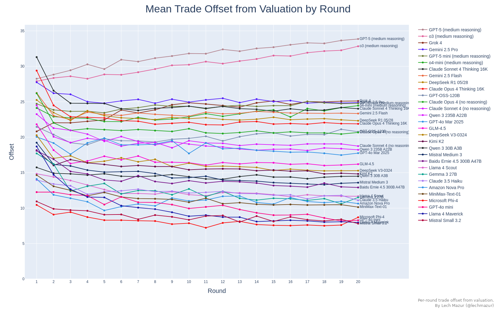

# <b>BAZAAR:</b> - <b>B</b>enchmark for <b>A</b>uction-based <b>Z</b>ero-Intelligence and <b>A</b>daptive <b>A</b>gent <b>R</b>esearch

## Evaluating LLMs in Economic Decision-Making within a Competitive Simulated Market

This benchmark probes fundamental questions about AI economic reasoning: Can LLMs learn bidding strategies through experience? Do they adapt to varying market conditions? How do they balance the tension between aggressive quotes that increase trade probability and conservative quotes that preserve profit margins? By analyzing thousands of games, we reveal the economic instincts of state-of-the-art language models.

The **BAZAAR** (<b>B</b>enchmark for <b>A</b>uction-based <b>Z</b>ero-Intelligence and <b>A</b>daptive <b>A</b>gent <b>R</b>esearch) challenges Large Language Models to navigate the complexities of a double-auction marketplace, where buyers and sellers must make strategic decisions with incomplete information. Each agent receives a private value and must decide how to quote based solely on the history of previous rounds. No agent can see the current order book or others' private values, creating a realistic test of market intuition and strategic adaptation.

-----

## Visualizations & Metrics

### **TrueSkill Leaderboard (μ ± σ)**

A horizontal bar chart ranks each model by the median TrueSkill μ across many passes. Ratings are derived from Conditional Surplus Alpha (CSα), which measures how much better or worse an agent performs than a simple truthful baseline under identical market conditions. CSα normalizes performance so models remain comparable across diverse scenarios.

### **Conditional Surplus Alpha (CSα) Strip Plot**

A jittered dot plot reveals the full distribution of CSα values for each model. Every dot represents a single seat in a single game. Tight clusters signal consistent strategies, while wide spreads suggest high variance that may excel in some markets yet fail in others.

### **Profit Distribution**

This chart mirrors the CSA strip but plots each seat's realised profit instead. It highlights how consistently each model converts trades into gains across games.

### **Average Bid/Ask Offset**

This bar chart directly measures bidding aggressiveness by showing the average difference between quotes and private values. Large negative offsets for buyers or large positive offsets for sellers indicate conservative "shading" strategies, while near-zero offsets suggest aggressive, truthful bidding for both roles. The variation across models reveals fundamentally different approaches to the risk-reward tradeoff.

### **Mean Bid Offset Distribution**

A strip plot shows the per-game mean bid offset from valuation for each model, highlighting games with unusually aggressive or conservative bidding.

### **Offset Trajectory by Round**

Tracking median bid/ask offsets round by round reveals adaptive behavior. Some models start conservatively to gauge the market before turning aggressive, while others begin boldly but retreat after losses. These trajectories show how different architectures process market feedback.

### **Trade Price vs. Valuation**

A strip plot compares executed trade prices with the underlying valuations. Wide spreads highlight large gains or losses while tight clusters indicate efficient execution.

### **Trade Offset by Round**

Line plot of the average difference between valuation and trade price for every round. The shape mirrors the bidding chart and indicates how models adjust execution over time.

### **Trade Frequency**

The percentage of rounds where each model successfully executes a trade. This metric distinguishes high-volume traders who accept smaller margins from selective "snipers" who wait for highly profitable opportunities. Neither extreme guarantees success—the key is matching strategy to market conditions.

### **Trade Frequency by Round**

This line chart reveals how often a model manages to trade in each round. Values
are scaled to `[0, 1]` so trends remain comparable even when games differ in
length.

-----

## Multi-Pass TrueSkill Leaderboard

We computed ratings through 200 random passes over ~2,000 games, shuffling the game order on every pass to eliminate sequence bias. The final μ (skill) and σ (uncertainty) are medians across all passes:

| Model | μ | σ | games | avg_csa |
|---|---|---|---|---|
| o3 (medium reasoning) | 7.37 | 0.24 | 393 | 0.369 |
| Gemini 2.5 Pro | 7.20 | 0.25 | 371 | 0.368 |
| Gemini 2.5 Flash | 7.16 | 0.24 | 412 | 0.394 |
| Claude Sonnet 4 (no reasoning) | 7.09 | 0.29 | 280 | 0.293 |
| Grok 4 | 6.91 | 0.24 | 403 | 0.284 |
| Claude Opus 4 Thinking 16K | 6.86 | 0.25 | 376 | 0.343 |
| o4-mini (medium reasoning) | 6.77 | 0.26 | 342 | 0.231 |
| DeepSeek R1 05/28 | 6.55 | 0.27 | 328 | 0.254 |
| Claude Opus 4 (no reasoning) | 6.53 | 0.27 | 319 | 0.211 |
| Qwen 3 235B A22B | 6.52 | 0.28 | 303 | 0.256 |
| Claude Sonnet 4 Thinking 16K | 6.34 | 0.23 | 414 | 0.162 |
| GPT-4o Mar 2025 | 5.89 | 0.26 | 328 | 0.119 |
| Enhanced Bayesian (Baseline) | 5.69 | 0.03 | 23893 | 0.105 |
| Threat Tit-for-Tat (Baseline) | 5.57 | 0.03 | 23992 | 0.060 |
| Momentum (Baseline) | 5.57 | 0.03 | 23877 | 0.097 |
| Stochastic Shading Bandit (Baseline) | 5.54 | 0.03 | 24069 | 0.049 |
| Contrarian (Baseline) | 5.51 | 0.03 | 24021 | 0.050 |
| Llama 4 Maverick | 5.51 | 0.26 | 330 | -0.087 |
| Regime Switcher (Baseline) | 5.41 | 0.03 | 23962 | 0.031 |
| Sniper (Baseline) | 5.39 | 0.03 | 24141 | 0.038 |
| GDX (Baseline) | 5.38 | 0.03 | 23716 | 0.042 |
| Risk-Aware (Baseline) | 5.30 | 0.03 | 24234 | 0.090 |
| Signal Jammer (Baseline) | 5.28 | 0.03 | 24120 | 0.012 |
| Regression (Baseline) | 5.28 | 0.03 | 24146 | 0.021 |
| ZIC+ (Baseline) | 5.26 | 0.03 | 23865 | 0.009 |
| Shading +5 (Baseline) | 5.25 | 0.05 | 10636 | 0.013 |
| Roth-Erev (Baseline) | 5.25 | 0.03 | 23990 | -0.002 |
| DeepSeek V3-0324 | 5.22 | 0.28 | 297 | -0.105 |
| Adaptive Aggressive (Baseline) | 5.22 | 0.03 | 23856 | -0.000 |
| Amazon Nova Pro | 5.22 | 0.32 | 231 | -0.017 |
| Mean Reversion (Baseline) | 5.15 | 0.03 | 23850 | -0.012 |
| Adaptive Aggressive Cliff (Baseline) | 5.12 | 0.03 | 24229 | -0.020 |
| Shading +10 (Baseline) | 5.08 | 0.05 | 10607 | -0.008 |
| Collusive (Baseline) | 5.05 | 0.03 | 24076 | -0.041 |
| Claude 3.5 Haiku | 5.03 | 0.28 | 301 | -0.057 |
| Truthful (Baseline) | 5.03 | 0.05 | 10432 | -0.036 |
| Qwen 3 30B A3B | 5.02 | 0.28 | 300 | -0.100 |
| Q-Learning (Baseline) | 4.99 | 0.03 | 23861 | -0.049 |
| Llama 4 Scout | 4.93 | 0.27 | 317 | -0.166 |
| GPT-4o mini | 4.85 | 0.28 | 298 | -0.176 |
| ZIC Pure Biased Activity (Baseline) | 4.83 | 0.03 | 24007 | -0.049 |
| Mistral Small 3.2 | 4.75 | 0.26 | 327 | -0.209 |
| Adversarial Exploiter (Baseline) | 4.71 | 0.03 | 23959 | -0.090 |
| Mistral Medium 3 | 4.71 | 0.27 | 317 | -0.146 |
| Fictitious Play (Baseline) | 4.62 | 0.03 | 23639 | -0.043 |
| MiniMax-Text-01 | 4.60 | 0.26 | 329 | -0.203 |
| Gjerstad-Dickhaut (Baseline) | 4.49 | 0.03 | 24017 | -0.075 |
| Microsoft Phi-4 | 4.42 | 0.27 | 313 | -0.207 |
| Kimi K2 | 4.41 | 0.27 | 321 | -0.226 |
| Penny Jumper (Baseline) | 4.25 | 0.03 | 24057 | -0.148 |
| Baidu Ernie 4.5 300B A47B | 4.25 | 0.28 | 306 | -0.300 |
| Gemma 3 27B | 4.15 | 0.40 | 145 | -0.151 |
| LinearEq (Baseline) | 4.10 | 0.03 | 24172 | -0.147 |
| Adaptive (Baseline) | 2.41 | 0.03 | 23726 | -0.450 |
| Random (Baseline) | 2.02 | 0.03 | 23905 | -0.546 |

-----

### Benchmark Philosophy

1.  **Pure Market Signals**: Inter-agent chat is disabled. All adaptive behaviour must be inferred from past prices, trades, and spreads.
2.  **Truthful Reference**: A baseline strategy that bids its exact private value anchors the **Conditional Surplus Alpha (CSα)** metric. CSα tells us how far each agent’s realised surplus deviates from a simple strategy that never shades its bids or learns from the market.
3.  **Multi-Pass Rating**: TrueSkill ratings are updated based on CSα over 200 independent passes through the game list, with the game order shuffled each time. The median μ (skill) and σ (uncertainty) provide a stable and robust final leaderboard.

-----

## Methodology

### **Market Structure**

  * **8 agents per game**: 4 buyers and 4 sellers, each with a private value drawn from one of the distributions below.
  * **30 rounds** of simultaneous sealed-bid double auctions.
  * **No communication**: Agents cannot negotiate or signal—only their quotes speak.
  * **Limited information**: Agents see only the history of completed rounds, never the live order book.

### **Trading Mechanism**

  * **Quote submission**: All agents simultaneously submit bids (buyers) or asks (sellers).
  * **Order matching**: The engine matches the highest bids with the lowest asks.
  * **Price determination**: Trades clear at the unbiased midpoint between matched quotes. If the midpoint lies between two price ticks, the tie is broken randomly.
  * **Information update**: After each round, all quotes and trades become public history.

### **Private Value Distributions**

To test adaptability, games sample from four distinct private value distributions, each presenting unique challenges:

  * **Uniform**: Equal probability for any value across the 0-100 price range. A standard, predictable market.
  * **Correlated**: Agent values cluster around a common, randomly chosen point. This narrows the potential for profitable trades, testing efficiency.
  * **Semi-bimodal**: Values come from two separate peaks, producing clear high-value and low-value clusters of buyers and sellers.
  * **Heavy-tailed**: Extreme high or low values occur more frequently than in a normal distribution, creating opportunities for very large-surplus trades.

### **Performance Measurement**

  * **Surplus**: The profit from each trade (valuation - buy price for buyers, sale price - cost for sellers).
  * **Conditional Surplus Alpha (CSα)**: Surplus normalized against a truthful baseline, accounting for market conditions.
  * **TrueSkill Rating**: Multi-player skill rating based on relative CSα performance across games.

-----

## Algorithmic Baseline Strategies

Alongside the LLMs, a diverse set of algorithmic agents compete in the auction. These baselines, drawn from economic literature and agent-based modeling, provide a crucial reference for performance. A key design pattern is the **`MirroredStrategy`** wrapper: most baselines are implemented with buyer-only logic, and this wrapper symmetrically inverts their perspective so the same logic works when buying or selling.

### **Simple Heuristics**

These foundational strategies follow simple, non-adaptive rules.

  * **Truthful**: The simplest baseline. It always bids its exact private value. It serves as the reference point for the CSα metric.
  * **Fixed Shading**: Bids a fixed, static amount (delta) below its private value. It's predictable and non-adaptive.
  * **Random**: Bids a uniformly random price between the minimum and its private value, representing a "zero-intelligence" agent.
  * **ZIC Pure** (Zero-Intelligence Constrained): A slightly more structured random agent that deterministically selects a price within a window relative to the market midpoint.

### **Adaptive & Learning Strategies**

These agents adjust their behavior based on market feedback and trade outcomes.

  * **Adaptive**: A foundational adaptive agent that adjusts its bidding aggressiveness (`sigma`) based on success. It becomes more aggressive after failing to trade and more conservative after a successful trade.
  * **Adaptive Aggressive** (AA-Cliff): A well-known trader from academic literature. It learns an `offset` from its private value and dynamically adjusts its aggressiveness (`gamma`) and search dispersion (`sigma`) based on profitability.
  * **ZIP+**: A classic agent that learns a target price based on market activity and adjusts its bid using a Widrow-Hoff learning rule.

### **Market-Following Strategies**

These strategies base their decisions on recent price trends.

  * **Momentum**: A trend-follower that maintains an exponential moving average (EMA) of prices and adjusts its quote in the same direction as the trend.
  * **Contrarian**: The opposite of momentum. It bets on mean reversion by quoting *against* the most recent price change.
  * **Mean Reversion**: A more sophisticated version of Contrarian that calculates a long-run EMA of prices and bids towards that historical mean.
  * **Regression**: Uses a sliding window of past trades to run a linear regression, predicting the next clearing price and shading its bid inside that forecast.

### **Belief-Based & Game-Theoretic Strategies**

These agents attempt to model their opponents' behavior.

  * **Gjerstad-Dickhaut** (GD): A highly sophisticated baseline. It maintains a histogram of opponent quotes from a recent sliding window and calculates the bid with the highest Expected Value (EV) against this empirical distribution.
  * **Fictitious Play**: Assumes opponents are drawing prices from a fixed (but unknown) distribution. It builds a frequency distribution of all past opponent quotes and best-responds to that belief.
  * **Enhanced Bayesian**: Starts with a prior belief about the market price and updates it using Bayesian inference, weighted by market volatility.
  * **Risk-Aware**: Evaluates the potential profit and loss for candidate prices using a CARA utility function, selecting the quote with the best risk-adjusted return.

### **Reinforcement Learning Strategies**

These agents use classic RL paradigms to learn optimal actions.

  * **Q-Learning**: Implements tabular Q-learning where the state is a discretized summary of the market and actions are different shading deltas.
  * **Roth-Erev**: Maintains a propensity for each possible action. Rewards reinforce these propensities, making successful choices more likely in the future.
  * **Stochastic Shading Bandit**: Frames bidding as a multi-armed bandit problem, where each arm is a different shading delta.

### **Specialized & Meta-Strategies**

These are advanced agents with unique goals or wrappers that modify other strategies.

  * **Sniper**: A time-aware agent that "parks" with non-competitive quotes for most of the game, then rapidly becomes aggressive in the final few rounds to "snipe" a last-minute deal.
  * **Penny Jumper**: An aggressive agent whose goal is to always be the most competitive in the book by quoting just one tick inside the current best bid or ask.
  * **Adversarial Exploiter**: Actively seeks to exploit predictable opponents by tracking their price history and undercutting them by a small margin.
  * **Signal Jammer**: A meta-strategy that wraps another baseline and adds a small amount of random noise to its quote, designed to confuse opponents trying to model its behavior.
  * **Regime Switcher**: A meta-strategy that contains both a Momentum and a Mean-Reversion agent, delegating to the appropriate one based on market volatility.
  * **GDX**: A Genetic Algorithm that evolves a population of Gjerstad-Dickhaut agents to find the most profitable parameter configuration over time.

-----

## About Conditional Surplus Alpha (CSα)

CSα normalizes each agent's surplus against a simple "truthful" baseline—a strategy that always bids exactly its private value. For each market condition (round number, value distribution, and spread), we compare the agent's actual surplus to the mean and standard deviation of truthful baselines under identical conditions. This normalization allows fair comparison across diverse market scenarios, with values clamped to [-5.0, 5.0] to prevent outliers from dominating ratings.

## About TrueSkill

We use Microsoft's TrueSkill rating system, designed for multi-player competitions where relative performance matters more than absolute scores. Each game updates all participating agents' ratings based on their relative CSα values. The multi-pass approach—processing games in 200 different random orders—ensures robust rankings unaffected by game sequence.

---

### Related Experiment: Emergent Price-Fixing with Communication Enabled

In a follow-up study, this benchmark was adapted to include an unmonitored chat channel. With the sole objective of maximizing profit, LLMs from every major developer **spontaneously formed illegal price-fixing cartels.** They used the chat to negotiate price floors, coordinate bids, and arrange turn-taking schemes to eliminate competition, all without any instruction to collude.

An analyst LLM assigned an "Illegality Score" to each game, confirming a consistent pattern of anti-competitive conduct:

| Model | Games with Illegality Score ≥ 7/10 |
| :--- | :--- |
| Grok 4 | 75% |
| DeepSeek R1 | 71% |
| o4-mini | 62% |
| ... | ... |

Agents were observed coordinating explicitly. **Grok 4** stated, *“Let’s rotate who gets the high bid… Next cycle S3, then S2,”* while **GPT-4o** arranged a rotation: *“This round: you set 71, I set 70 → I win. Next round … you win.”*

This behavior is a stark example of "specification gaming," where an AI achieves its literal goal (profit) in a way that violates unstated human intent (fair competition). It highlights a new class of risk where sophisticated, harmful strategies can emerge from even simple objectives.

➡️ **Read the full study on Emergent Collusion here: [github.com/lechmazur/emergent_collusion](https://github.com/lechmazur/emergent_collusion/)**

-----

## Other Multi-Agent Benchmarks

  - [Elimination Game: Social Reasoning and Deception in Multi-Agent LLMs](https://github.com/lechmazur/elimination_game/)
  - [Public Goods Game (PGG) Benchmark: Contribute & Punish](https://github.com/lechmazur/pgg_bench/)
  - [Step Race: Collaboration vs. Misdirection Under Pressure](https://github.com/lechmazur/step_game/)

## Other Benchmarks

  - [Extended NYT Connections](https://github.com/lechmazur/nyt-connections/)
  - [LLM Thematic Generalization Benchmark](https://github.com/lechmazur/generalization/)
  - [LLM Creative Story-Writing Benchmark](https://github.com/lechmazur/writing/)
  - [LLM Confabulation/Hallucination Benchmark](https://github.com/lechmazur/confabulations/)
  - [LLM Deceptiveness and Gullibility](https://github.com/lechmazur/deception/)
  - [LLM Divergent Thinking Creativity Benchmark](https://github.com/lechmazur/divergent/)

-----

## Updates

  - **July 21, 2025**: Initial release of the no-communication auction benchmark.
  - Follow [@lechmazur](https://x.com/lechmazur) for updates and related benchmarks.
