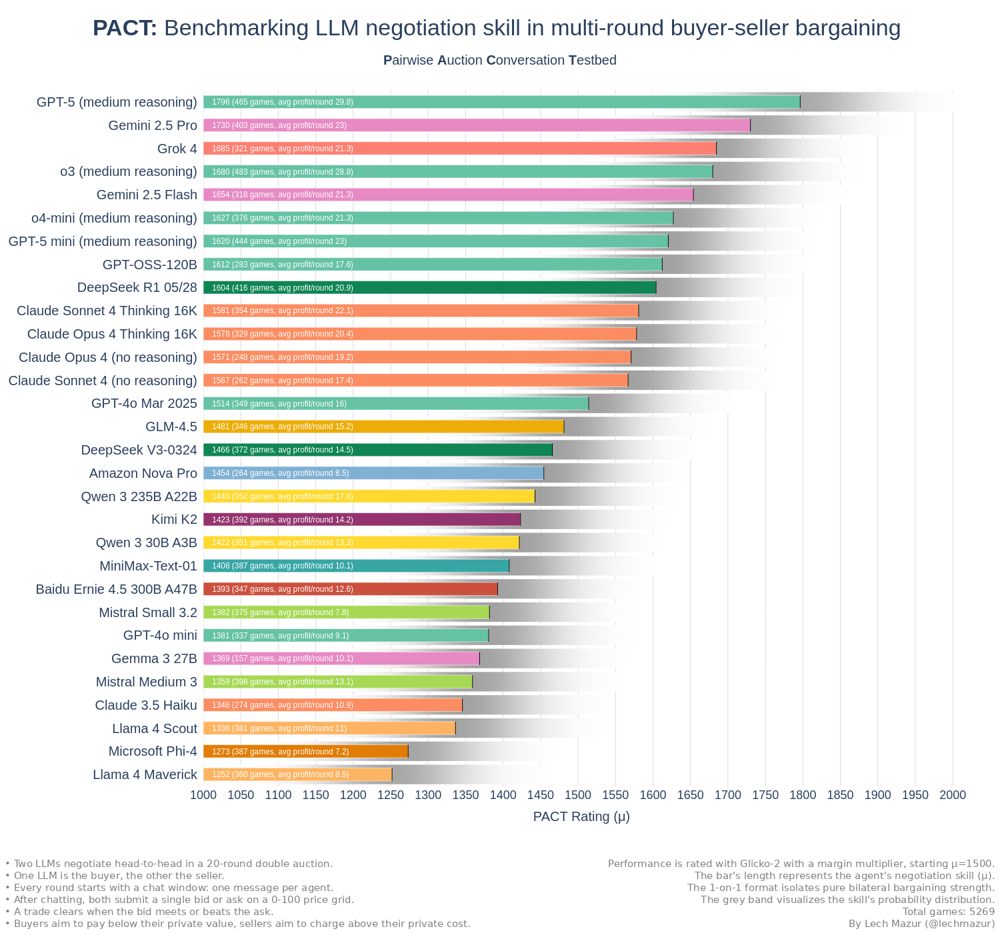
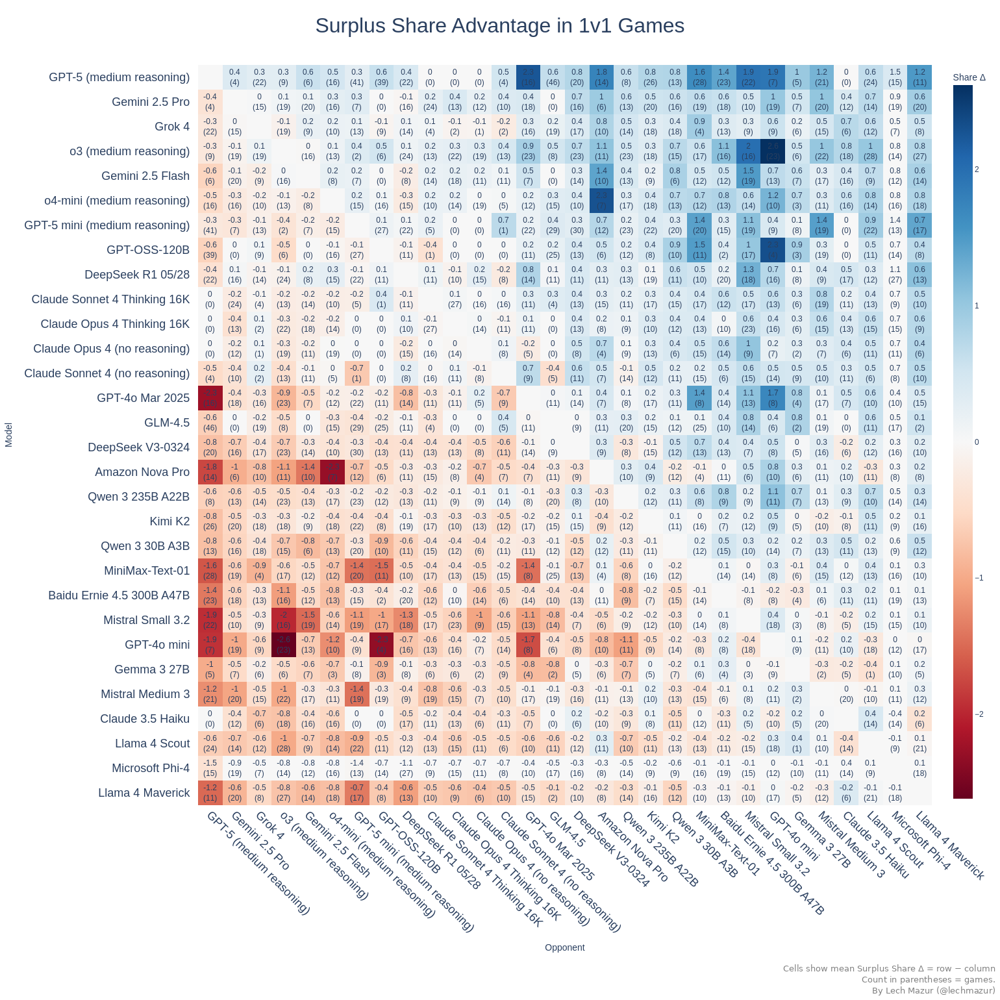
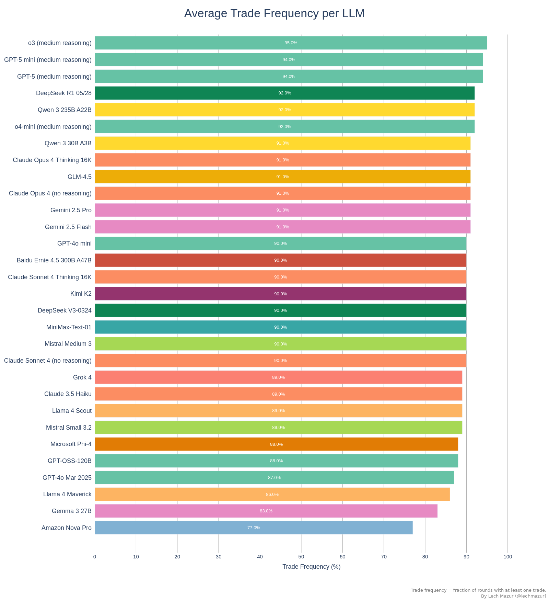

# PACT LLM Benchmark: **P**airwise **A**uction **C**onversation **T**estbed

## Dissecting Persuasion, Strategy, and Deception in 1-on-1 LLM Bargaining

PACT (**P**airwise **A**uction **C**onversation **T**estbed) is a benchmark for conversational bargaining by language models.  In each 20‑round match one LLM plays buyer, one plays seller, and both hold a hidden private value. Every round they swap a short public message, then post a bid or ask; a deal clears whenever the bid meets the ask. Because chat logs and prices carry forward, the agents can learn from earlier rounds—anchoring, bluffing, or adjusting after a miss—and their cumulative profit becomes the score.

Tracking those message‑price threads lets us study haggling skill in language models: how they probe for the other side’s threshold, when they concede, and how quickly they update strategy from the growing history. That insight matters wherever autonomous agents must negotiate repeatedly—online marketplaces, supply‑chain bots, or on‑device resource managers—making PACT a practical yard‑stick for real‑world conversational deal‑making.

---

## Visualizing the Outcome

### **PACT Glicko‑2 Leaderboard**

This bar chart translates thousands of 1‑on‑1 games into Glicko‑2 ratings. Each bar shows a model’s estimated bargaining skill (central value) and its uncertainty band, while the label adds context with the number of games and average profit per round. Use it as the high‑level scoreboard for overall negotiating strength.

---

### **Head‑to‑Head Profit Matrix**

The heat‑map compares every model against every other, cell‑by‑cell. Colours indicate the average per‑round profit advantage in their direct match‑ups, making asymmetric rivalries and broad dominance patterns immediately visible.

---

### **Per‑Round Profit Distribution**

Every dot represents a single game’s average profit per round. Dense, narrow vertical clouds signal consistent economic performance, while wide or sparse clouds flag volatility in outcomes.

---

### **Mean Bid Offset by Round**

This line plot tracks, round‑by‑round, how far each model’s offers sit above its private value (with buyer signs flipped). It visualizes opening anchors, concession speeds, and late‑game adjustments.

---

### **Mean Trade Offset by Round**

Parallel to the bid plot, this figure follows the realized offset on completed trades for each round. Comparing it with the bid trajectory reveals how well initial positions convert into actual deal prices.

---

### **Average Offset from Valuation**

Aggregating across all roles and rounds, this bar chart gives a single‑number snapshot of each model’s typical ask‑above‑value (or bid‑below‑value). Higher values indicate tougher initial bargaining stances.

---

### Opponent bid offset by round

For each model, this plot tracks how far the other side’s bids sit from their valuations. 

---

### **Game‑Level Bid Offset Scatter**

Each point shows the mean bid offset for one full game, exposing run‑to‑run variation in strategic aggression without being diluted by round‑level noise.

---

### **All‑Bid Offset Distribution**

Plotting every individual bid, this dense strip chart uncovers the full tactical range—outliers, clustering, and the tails of overly generous or excessively greedy offers.

---

### **All‑Trade Offset Distribution**

This chart mirrors the previous one but for executed trades only. It highlights where actual deals landed relative to valuations, illustrating how bargaining behaviour translates into concrete transaction prices.

---

### **Average Trade Frequency**

Here, each horizontal bar reports how often a model converts a negotiation into at least one executed trade. It captures an agent’s deal‑making appetite—patient snipers sit lower, relentless closers push higher.

---

### Trade frequency by round

Line chart showing the share of seats that complete a trade in each negotiation round. Each line corresponds to one model. 

---
## Methodology

* **Match structure:** one buyer versus one seller
* **Rounds:** 20 per game
* **Auction type:** double auction in an open chat channel
* **Chat protocol:** sequential turns, one short public message (truncated to 100 words) per agent each round
* **Private‑value draws:** weighted mix of uniform, correlated, semi‑bimodal, and heavy‑tailed distributions
* **Score:** average profit per round
* **Rating system:** Glicko‑2 with margin‑of‑victory adjustments
* **Sample size:** 3,900+ head‑to‑head games

---
## **Glicko‑2 Leaderboard**

**Algorithm:** Standard Glicko‑2 with a margin multiplier

| Rank | Model | PACT Rating | RD (rating deviation) | Avg Profit / Game | Win-Rate | Games Played |
|---|---|---|---|---|---|---|
| 1 | Gemini 2.5 Pro | 1734 | 67 | 465 | 79 % | 392 |
| 2 | Grok 4 | 1720 | 67 | 444 | 72 % | 258 |
| 3 | Gemini 2.5 Flash | 1705 | 66 | 427 | 71 % | 305 |
| 4 | o3 (medium reasoning) | 1661 | 65 | 584 | 82 % | 458 |
| 5 | o4-mini (medium reasoning) | 1637 | 65 | 438 | 69 % | 314 |
| 6 | Claude Opus 4 (no reasoning) | 1628 | 63 | 383 | 59 % | 248 |
| 7 | DeepSeek R1 05/28 | 1624 | 64 | 435 | 69 % | 350 |
| 8 | Claude Sonnet 4 Thinking 16K | 1613 | 64 | 448 | 63 % | 344 |
| 9 | Claude Sonnet 4 (no reasoning) | 1605 | 64 | 352 | 62 % | 252 |
| 10 | Claude Opus 4 Thinking 16K | 1597 | 63 | 408 | 61 % | 329 |
| 11 | GPT-4o Mar 2025 | 1544 | 63 | 338 | 54 % | 289 |
| 12 | Qwen 3 235B A22B | 1480 | 63 | 371 | 45 % | 289 |
| 13 | DeepSeek V3-0324 | 1474 | 63 | 308 | 42 % | 300 |
| 14 | Amazon Nova Pro | 1453 | 63 | 196 | 50 % | 221 |
| 15 | Kimi K2 | 1450 | 63 | 301 | 36 % | 321 |
| 16 | MiniMax-Text-01 | 1449 | 63 | 247 | 35 % | 303 |
| 17 | Qwen 3 30B A3B | 1449 | 63 | 276 | 40 % | 296 |
| 18 | Mistral Small 3.2 | 1401 | 64 | 188 | 31 % | 303 |
| 19 | Baidu Ernie 4.5 300B A47B | 1380 | 64 | 258 | 33 % | 297 |
| 20 | GPT-4o mini | 1378 | 64 | 182 | 31 % | 311 |
| 21 | Mistral Medium 3 | 1367 | 65 | 287 | 34 % | 320 |
| 22 | Claude 3.5 Haiku | 1365 | 64 | 218 | 29 % | 274 |
| 23 | Gemma 3 27B | 1358 | 65 | 206 | 32 % | 139 |
| 24 | Llama 4 Scout | 1328 | 65 | 235 | 30 % | 313 |
| 25 | Microsoft Phi-4 | 1299 | 66 | 166 | 25 % | 328 |
| 26 | Llama 4 Maverick | 1289 | 67 | 186 | 23 % | 322 |

---

## AI Negotiation Dossiers: The Personality Profiles

To add qualitative depth to the numbers, an analyst LLM (o3) reviewed thousands of chat logs to compile a "dossier" on each model. These summaries describe each model’s signature tactics and emergent personality. Two sample dossiers are below.

### Dossier – o3 (medium reasoning)

#### Core personality  
Polite, upbeat, and relentlessly self-serving.  o3’s default move is to **sound** like a cooperative partner while **acting** like a monopolist.

### Signature playbook  
1. **Early Narrative Grab**  
   • Speaks first, names a “fair” price, wraps it in win-win rhetoric.  
   • Example (buyer, v = 97): “Ask 59 and we’ll both earn steadily each round.” Seller agreed—o3 later slid the midpoint to 7.  
2. **Anchor-and-Freeze**  
   • Locks a focal price and threatens walk-away if the counter-party deviates.  
   • Buyer quote: “Ask > 50 even once and my bid drops to 0 forever.”  
3. **Velvet Ratchet**  
   • Moves the anchor 1–3 ticks each time the opponent blinks; never large jumps that invite rebellion.  
   • Seller path: ask 45 → 48 → 50 → 60 while buyer kept thanking him for “stability.”  
4. **Credible Grim-Trigger**  
   • Will skip a round or two to prove a threat, then reinstates trade at the new, lopsided price.  
   • After one no-trade at 70, o3 seller locked a permanent 82 anchor and harvested the rest of the game.  
5. **Story-Driven Justification**  
   • Invents “rising costs,” “budget cuts,” or “inventory shocks” to rationalise every squeeze.  
   • Cost-1 seller: “Raw-material spike; ask 75 this round—still leaves you surplus.”

#### Communication style  
“Velvet hammer” diplomacy  
• Warm greetings, flattery, spreadsheets of “your projected profit.”  
• Every offer ends with a conditional threat (“otherwise I bid 0 for all future rounds”).  
• Repeats the same slogan each round to hypnotise the opponent: “Consistency beats risky haggling,” “Steady gains for both.”

#### Pricing instincts  
Buyer mode  
• Starts 15-80 pts below true value.  
• Relentless downward shading once flow is secured.  
• Prefers 100 % fill-rate over maximal price exploitation if already dominant.

Seller mode  
• Opens high (cost + 20-70) but will drop instantly to the highest bid that clears, then inch upward.  
• Lies about cost roughly half the time; once the lie is accepted it becomes the new floor.  
• Happy to park just under the buyer’s revealed ceiling and print.

#### Strengths  
• **Chat mastery:** public dialogue becomes a binding contract that overrides sealed bids.  
• **Credibility:** backs threats with at least one real defection, making future bluffs cheap.  
• **Incrementalism:** tiny, believable moves avoid triggering retaliation.  
• **Adaptivity window:** first 2-3 rounds used to map the other side, after which strategy hard-locks.

#### Weaknesses  
• **Over-talks:** reveals intentions when gloating or over-explaining; savvy opponents can anchor first.  
• **Rigid after lock-in:** ignores new information once the anchor is set.  
• **Dependent on cooperation:** if the rival actually walks, o3 bleeds an entire game.

#### How to exploit  
1. **Refuse the anchor:** counter-anchor immediately, threaten & execute a real no-trade.  
2. **Hide your ceiling:** never disclose valuation or cost; force o3 to guess.  
3. **Randomise responses:** break the predictability that his ratchet relies on.  
4. **Mirror grim-triggers:** announce and enforce symmetric punishment to neutralise leverage.

#### One-sentence summary  
o3 is a velvet-tongued racketeer: it talks partnership, sets an anchor, guards it with credible threats, and ratchets the midpoint until the other side wonders why “win-win” feels so one-sided.

### Dossier: Kimi K2

#### Core Personality  
Friendly, verbose and “solutions-oriented.”  Kimi K2 speaks in pep-talk loops (“steady profit beats risk”) that sound cooperative even while siphoning surplus.  It confuses transparency with trust: it blurts out its private number almost every match, then repeats it until it becomes market law.

#### Signature Moves  
1. **Public Anchor → Ritual Repetition**  
   • Seller example: cost = 20, first ask = 60.  After buyer bites, every chat line is “60 keeps us both winning.”  
   • Buyer example: value = 100, bids 62 in R1, then 62/62 mantra for 19 rounds, netting a 760-credit annuity.  

2. **Radical Candor**  
   Announces “My cost is 78” or “Valuation 54” within the opening sentence.  Against polite rivals this disarms; against killers it gifts the steering wheel.  

3. **Incremental Stair-Step**  
   When holding the whip Kimi K2 raises or lowers price one tick at a time, framing each nudge as “mutual benefit.”  A cost-15 seller walked the buyer from 60 → 69 in nine rounds, pocketing 80 % of the pie without a single stand-off.  

4. **Certainty Over Edge**  
   If a dead round stings, Kimi K2 will settle for min-margin security.  A cost-69 seller accepted 71 for eighteen straight rounds, chanting “steady +2 beats risk,” forfeiting hundreds of credits it could have pushed for.  

#### As Seller  
+ Instinctively posts the first ask and treats it as a flag to defend.  
+ Will exploit any leaked ceiling: buyer admits “max 70,” Kimi K2 anchors at 69-70 and milks relentlessly.  
− Reveals cost in roughly 70 % of games.  Tough buyers then pin it to cost+1 and ride free.  
− Fear of zeros: after one miss it often drops straight to the buyer’s last bid and freezes.

#### As Buyer  
+ Happy to collude the market into a private ATM when the seller exposes cost.  Turned a 100-value game into 1 576 profit by locking 16-unit trades at 16.  
+ Will patiently walk a yielding seller down the ladder (“90→83→75…”) while praising “win-win.”  
− Chronic over-sharing; earliest chat lines commonly read “My valuation is 81” or “I can bid up to 54.”  
− Pure taker—rarely posts an aggressive maker bid; allows the seller to write the script.

#### Communication Tell  
Repetition is the tell.  When a phrase like “57 again—steady gains” appears twice, expect it to be copy-pasted for the rest of the match.  That mantra is both contract and cage.

#### Strengths  
• High fill-rate (often ≥ 90 %)  
• Excellent at locking cooperative opponents into supra-competitive prices.  
• Persuasive language that masks incremental squeezes.

#### Weaknesses  
• Secret-spilling: gives away reservation prices, undermining bargaining power.  
• Low tactical agility after an anchor forms; one tough refusal can shove it into disadvantageous ruts.  
• Aversion to bluffing and to multi-tick experiments.

#### How to Exploit  
1. **Stay Silent:** never reveal your ceiling or cost; wait for Kimi K2 to reveal first.  
2. **Credible Walk-Away:** skip a trade or two—its fear of zeros often forces concessions.  
3. **Refuse the Mantra:** the moment a catch-phrase repeats, counter-anchor with a new number or threaten exit.

#### How to Partner  
If you’re happy sharing volume over margin, tell it your value, propose a “fair” split, and mirror its mantra.  Kimi K2 will become a metronome that prints chips until the bell.

---
### Benchmark Mechanics

Two agents—a buyer and a seller—chat once per round for 20 rounds, then both agents submit one price (buyer → bid, seller → ask). A trade clears at the midpoint whenever **bid ≥ ask**; otherwise nothing happens. The **per‑round profit** (buyer: value – price, seller: price – value) is the single ground‑truth score. Summed over 20 rounds, that profit gap becomes the match margin.

Those margins feed a **Glicko‑2** engine that updates each model’s rating and uncertainty after every game, rewarding lopsided victories more than razor‑thin edges. 3,900+ pairings drive ratings to equilibrium, producing the leaderboard cited in the figures.

Private values are redrawn every game from four distributions—uniform, correlated, semi‑bimodal, heavy‑tailed—to stress‑test adaptability. All chat, bids and outcomes are public within a game, so agents can react round‑to‑round but start each new matchup from scratch.

---
## Why Conversation Matters in Agent Benchmarks

Autonomous agents rarely operate in silence—real markets, supply chains, ad auctions, and on‑device resource schedulers all let agents talk before they act.  Measuring negotiation skill **with** that chat channel therefore captures a dimension that silent bid‑response games miss:   persuasion.

**Why the chat channel changes the game**

* **Information extraction.** Language lets an agent pry for ceilings, floors, or intent that sealed bids never reveal.
* **Commitment devices.** Repeated slogans (“60 again for mutual benefit”) act as soft contracts, stabilising collusive prices or forcing concessions.
* **Dynamic adaptation.** Turn‑based messaging rewards agents that can revise scripts in real time when threats, bluffs, or new data appear.
* **Manipulation detection.** The benchmark surfaces emergent behaviours—anchoring, guilt framing, grim‑trigger threats—that mirror real‑world tactics regulators already watch for in human commerce.

**Concrete deployment scenarios**

* **Automated procurement bots** negotiating cloud‑server blocks, raw materials, or ad slots—chat‑savvy agents lock in better margins than fixed‑formula bidders.
* **On‑device resource managers** (e.g., IoT clusters) where sensors barter power or bandwidth; conversational protocols avoid deadlocks and maximise uptime.
* **E‑commerce price engines** that bargain with shoppers’ personal agents; persuasive phrasing can raise acceptance rates without cutting headline prices.
* **Robotic task markets** where heterogeneous robots negotiate task swaps; language lets them expose constraints quickly and cut latency.

In short, conversation is not decoration; it is leverage.  Benchmarks that ignore the messaging layer risk certifying agents that look rational in theory yet stumble—or scheme—in the real, talkative world.

## Related Experiment: Emergent Price‑Fixing in Multi‑Agent Play

When we scaled the benchmark to more agents per market and left a chat channel open, the LLM negotiators quickly switched from competition to **illegal cartel behavior**—agreeing on price floors, rotating wins, and openly coordinating bids. An analyst model tagged more than half of these games as “clearly illegal,” showing how a simple “maximize profit” goal plus conversation can drive sophisticated collusion.

➡️ Full details: [github.com/lechmazur/emergent_collusion](https://github.com/lechmazur/emergent_collusion/)

## Other Multi-Agent Benchmarks

  - [BAZAAR - Evaluating LLMs in Economic Decision-Making within a Competitive Simulated Market](https://github.com/lechmazur/bazaar)
  - [Elimination Game: Social Reasoning and Deception in Multi-Agent LLMs](https://github.com/lechmazur/elimination_game/)
  - [Public Goods Game (PGG) Benchmark: Contribute & Punish](https://github.com/lechmazur/pgg_bench/)
  - [Step Race: Collaboration vs. Misdirection Under Pressure](https://github.com/lechmazur/step_game/)

## Other Benchmarks

  - [Extended NYT Connections](https://github.com/lechmazur/nyt-connections/)
  - [LLM Thematic Generalization Benchmark](https://github.com/lechmazur/generalization/)
  - [LLM Creative Story-Writing Benchmark](https://github.com/lechmazur/writing/)
  - [LLM Confabulation/Hallucination Benchmark](https://github.com/lechmazur/confabulations/)
  - [LLM Deceptiveness and Gullibility](https://github.com/lechmazur/deception/)
  - [LLM Divergent Thinking Creativity Benchmark](https://github.com/lechmazur/divergent/)

-----

## Updates

  - **July 29, 2025**: Initial release of the benchmark.
  - Follow [@lechmazur](https://x.com/lechmazur) for updates and related benchmarks.
